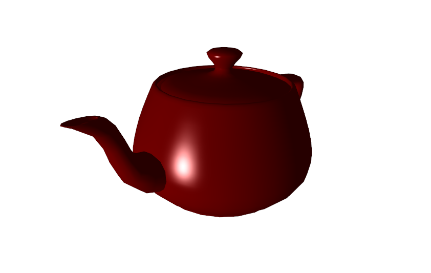
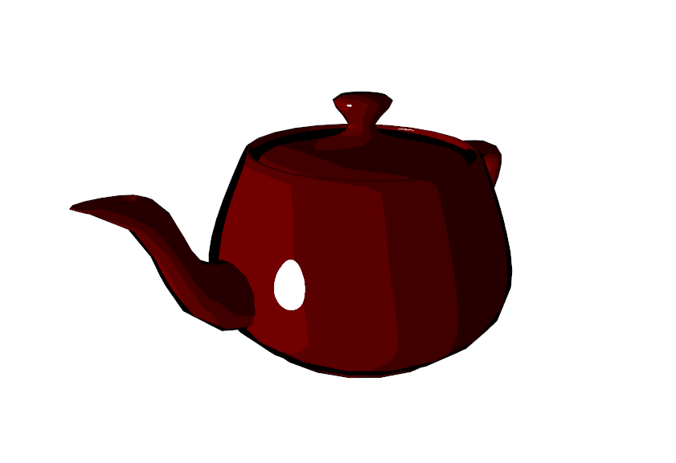
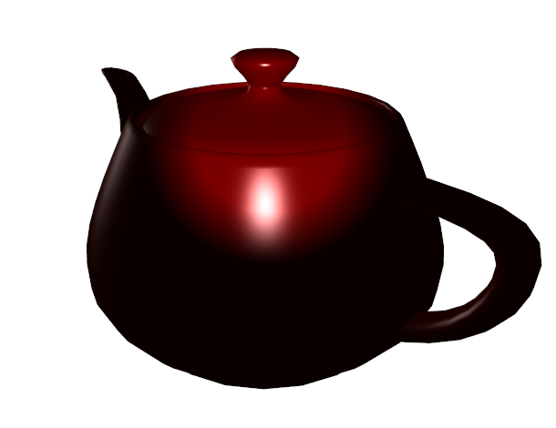

# OpenGL3 3D C++ Library (For learning purposes)
Implementing many rendering techniques used in Computer Graphics and methods to setup complex scenes.

# Screenshots

Phong Shader:

Cel Shader:

Spotlight:

Scene Tree:

# Setup
1. Clone the repository.
2. Open the solution file in Visual Studio 2017.
3. Set the sample project as the default startup project.
4. Run

# Features
## Local Illumination
- [x] Phong Shader
- [x] Cel Shader
- [ ] Blinn Shader (currently broken)
- [x] Point Lights
- [x] Directional Lights
- [x] Spotlights
- [ ] Distance Attentuation for all light types
- [ ] Texturing
- [ ] Normal Mapping
- [ ] Reflection Mapping
- [ ] Shadow Maps

## Geometry
- [x] Sphere
- [x] Square
- [ ] Conics
- [ ] Surface of Revolution functions
- [ ] Bezier Curves / Basis Splines
- [ ] Drawing with Frenet Frames
- [ ] L-Systems for Trees
- [ ] Extrusions
- [ ] Collisions

## Transformations
- [x] Scene Trees

## Global Illumination
- [ ] Realistic reflections
- [ ] Volumetric ray tracing

## Miscellaneous
- [ ] Particle Systems

# Libraries used
- [GLFW3](https://www.glfw.org/)
- [Glew](http://glew.sourceforge.net/)
- [LodePNG](https://lodev.org/lodepng/)
- [TinyObjLoader](https://github.com/syoyo/tinyobjloader)

# License
This project is licensed under the MIT License.
